<h1 align="center">Hey there!!   I'm Srishti </h1>
<h3 align="center">Welcome to my profile!!</h3>

  

- 💬 Ask me about **Web Development**

- 📫 How to reach me **srishtimanna2@gmail.com**

<!-- 
 
 
  

 -->

<h3 align="left">Connect with me:</h3>

<h3 align="left">Languages and Tools:</h3>

               

&nbsp;

                                                                                      
                                                                                                                             
 <h2 align="left">⚡Activity Graph:</h2>
        

 <h2 align="left">🐍Watch my contribution graph get eaten by a snake</h2>
   

 <h2 align="left">✍️ Random Dev Quote</h2>
  
  

    
  
    
<h2 align="left">👽 Check out my Git Art</h2>
  
  

   
  
    

 

